# MCP Web Search Server - Architecture

## What is MCP?

**MCP (Model Context Protocol)** is a protocol for connecting AI assistants to external tools and data sources. Think of it as "USB-C for AI applications" - a standardized way for LLMs to discover and use capabilities provided by external servers.

### Key Characteristics

| Aspect | REST API | MCP |
|--------|----------|-----|
| **Purpose** | Client-server communication for apps | LLM-tool communication |
| **Discovery** | Manual (read docs) | Automatic (tool schemas exposed) |
| **Transport** | HTTP/HTTPS | HTTP/SSE or stdio |
| **Protocol** | HTTP verbs + JSON | JSON-RPC 2.0 |
| **State** | Stateless | Stateful connection with lifecycle |
| **Intent** | CRUD operations | Tool execution + context sharing |

## Architecture Overview

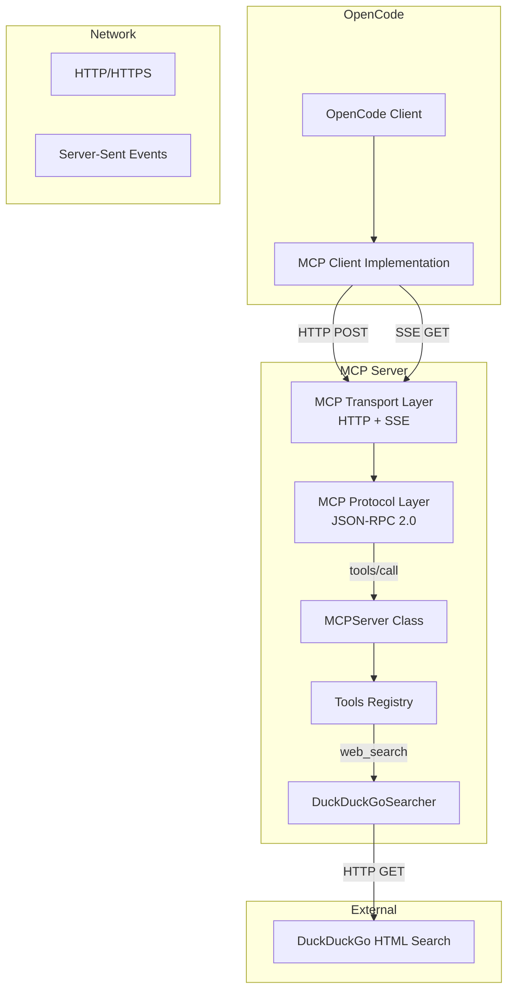

## MCP Protocol Flow

### 1. Connection Lifecycle

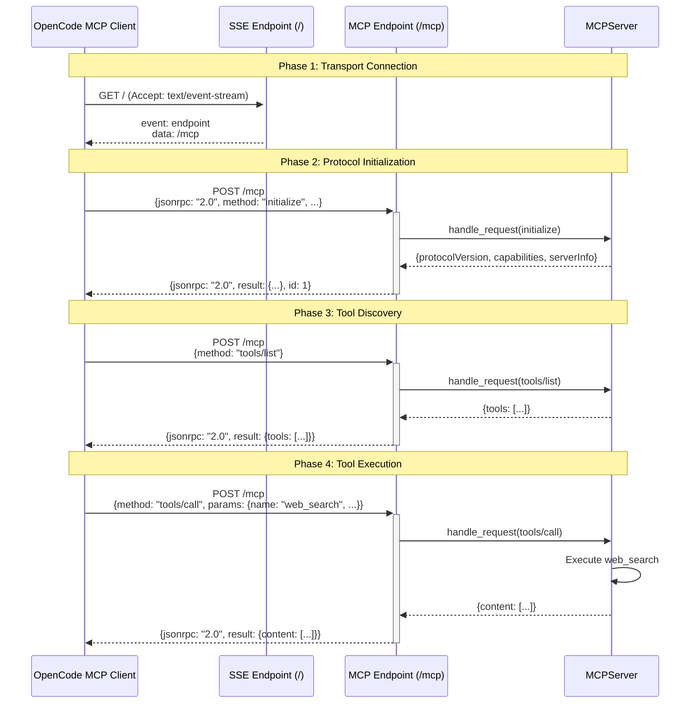

### 2. Transport Layer Detail

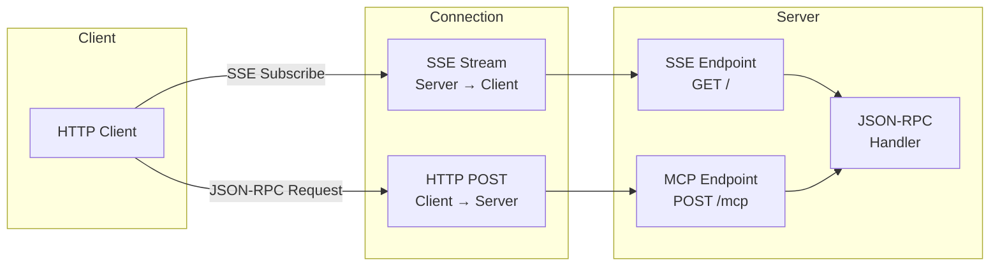

## Comparison: REST vs MCP

### REST API Approach

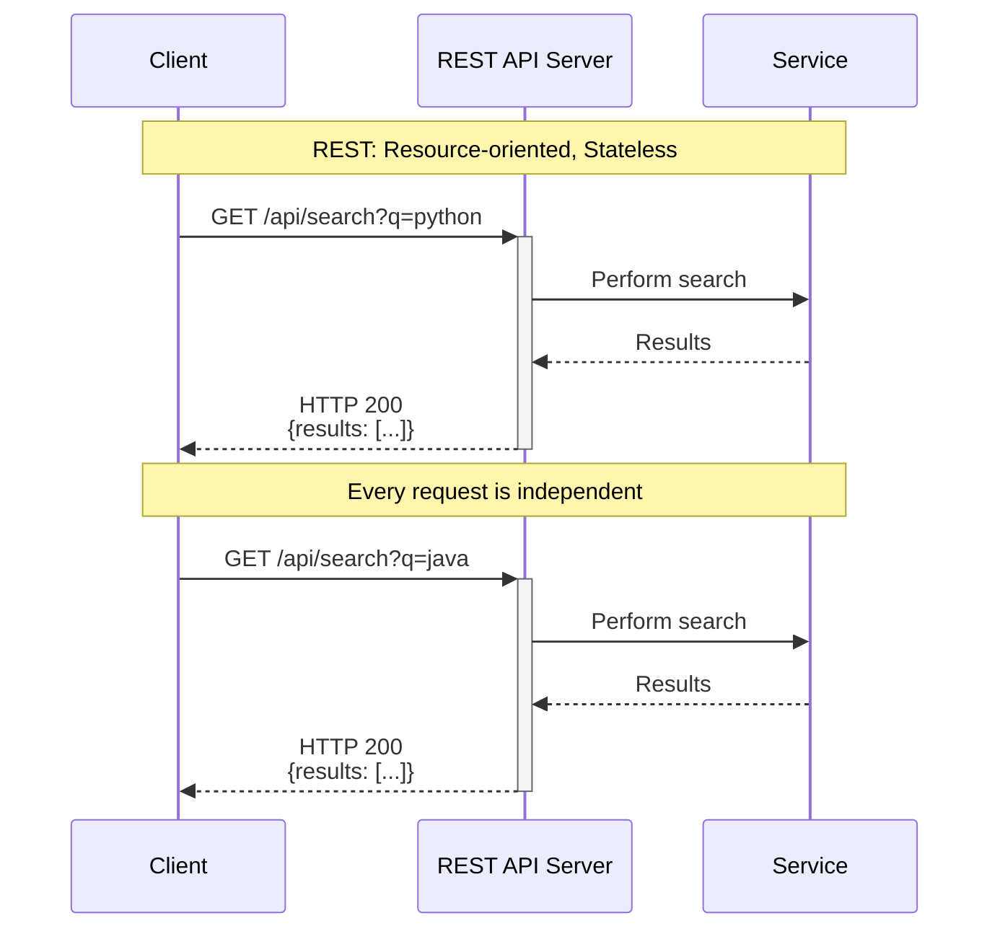

### MCP Approach

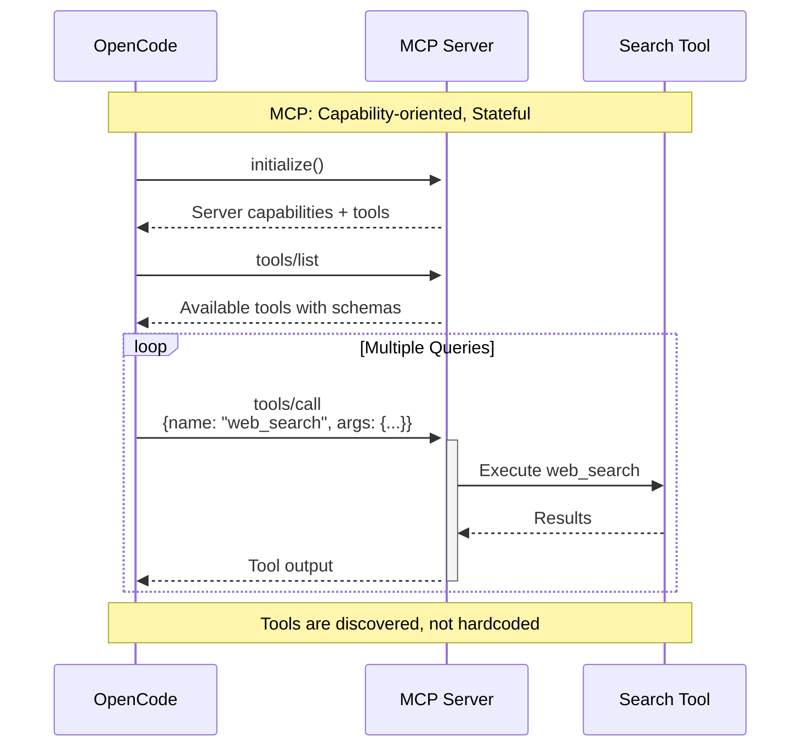

## System Components

### Component Architecture

```mermaid
graph TB
    subgraph "MCP Server Container"
        direction TB
        
        subgraph "Transport Layer"
            HTTP_EP[HTTP Endpoints<br/>FastAPI]
            Health[/health]
            Search[/search]
            Root[/]
            MCP_EP[/mcp]
            SSE_EP[/sse]
            
            HTTP_EP --> Health
            HTTP_EP --> Search
            HTTP_EP --> Root
            HTTP_EP --> MCP_EP
            HTTP_EP --> SSE_EP
        end
        
        subgraph "Protocol Layer"
            MCP[MCPServer Class]
            JSON_RPC[JSON-RPC 2.0<br/>Request Handler]
            
            MCP --> JSON_RPC
        end
        
        subgraph "Application Layer"
            WS[web_search function]
            SH[search_health function]
            DDGS[DuckDuckGoSearcher]
            
            WS --> DDGS
        end
        
        MCP_EP --> JSON_RPC
        JSON_RPC --> WS
        JSON_RPC --> SH
    end
    
    subgraph "External"
        DDG[DuckDuckGo]
    end
    
    DDGS -->|HTTP Request| DDG
```

### Data Flow

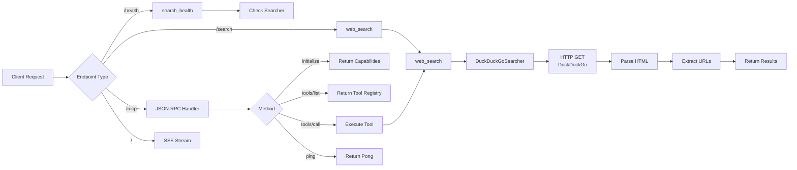

## Why MCP Instead of REST?

### The Problem with REST for LLMs

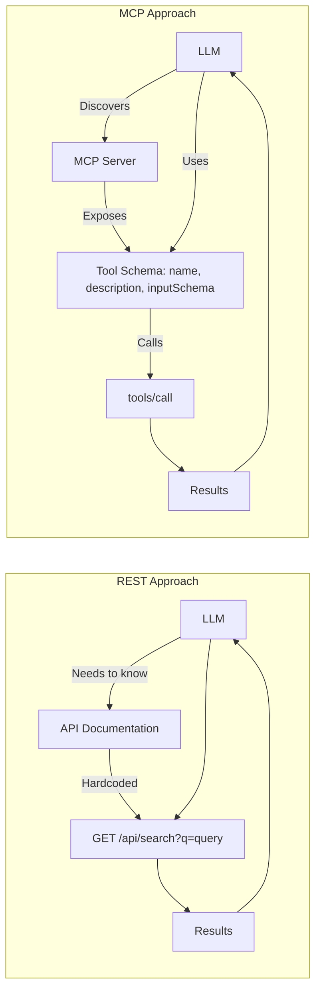

### Key Differences

| Feature | REST API | MCP |
|---------|----------|-----|
| **API Discovery** | Manual (docs, OpenAPI) | Automatic (tools/list) |
| **Tool Schema** | Separate (OpenAPI spec) | Built-in (inputSchema) |
| **Context Sharing** | Custom headers/cookies | Protocol-level support |
| **Multiple Tools** | Multiple endpoints | Single endpoint, dynamic dispatch |
| **LLM Optimized** | ❌ | ✅ (designed for LLM agents) |

## MCP Protocol Details

### JSON-RPC Message Format

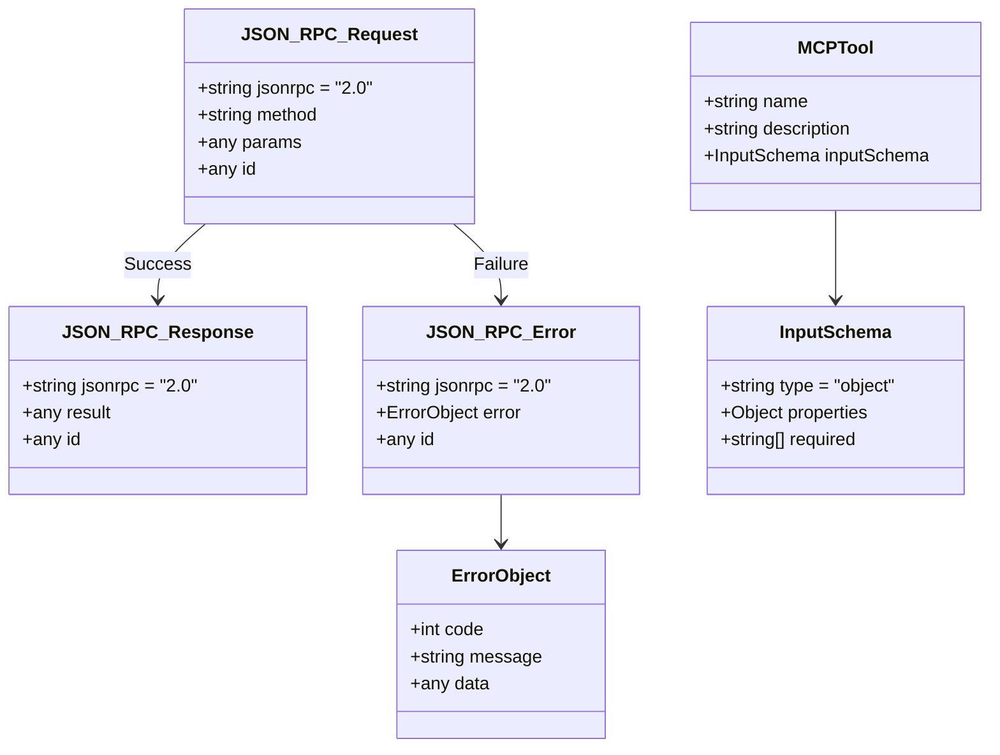

### Server-Sent Events (SSE) Flow

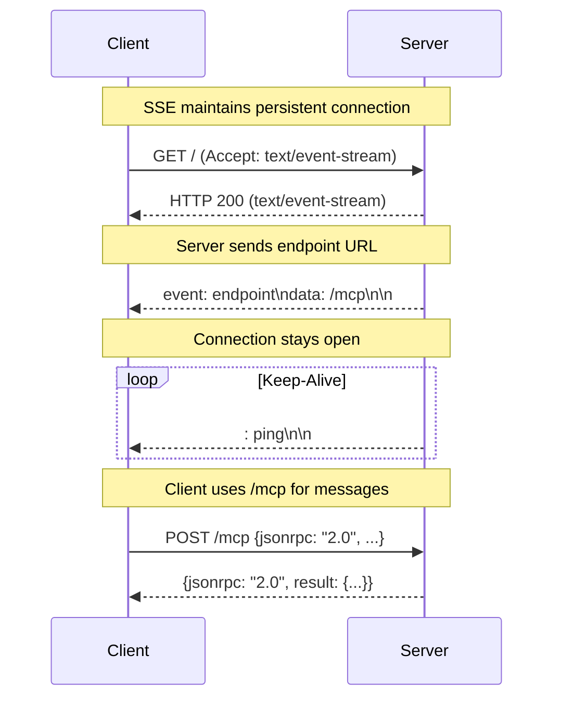

## Implementation Specifics

### Tool Definition

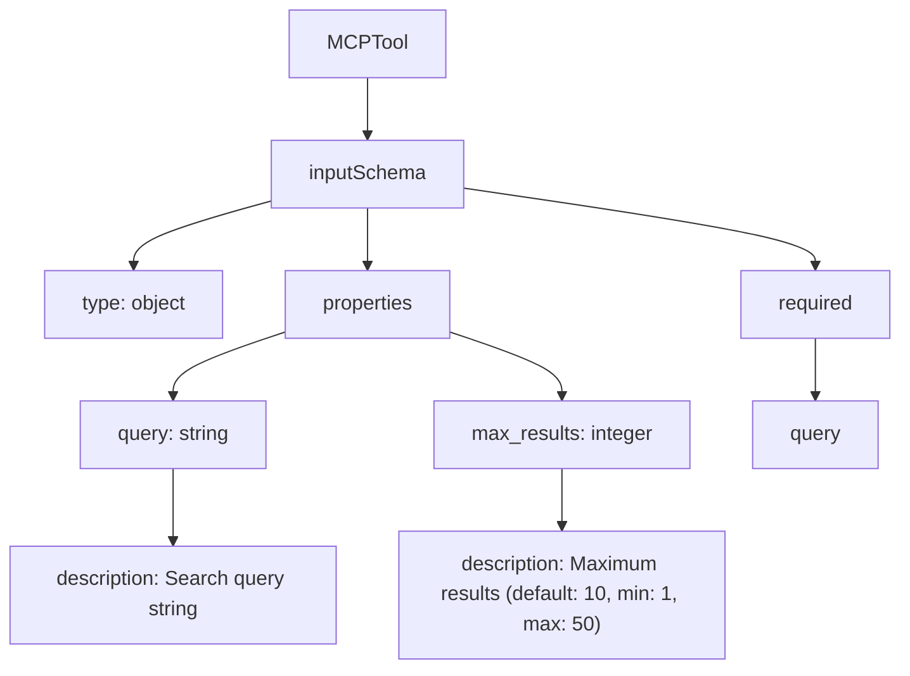

### URL Extraction Flow

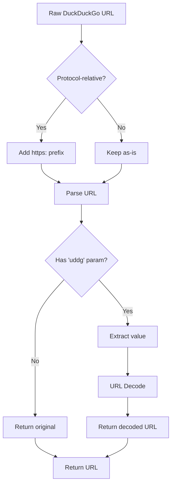

## Summary

MCP is essentially a **capability discovery and execution protocol** built on JSON-RPC over HTTP+SSE. While REST is resource-oriented ("GET /users/123"), MCP is capability-oriented ("Call the web_search tool with these parameters").

The key insight: MCP servers **advertise their capabilities** with schemas, allowing LLMs to discover and use tools dynamically rather than relying on hardcoded API endpoints.

**For experienced REST developers:**
- Replace REST endpoints with `tools/call` endpoint
- Replace HTTP verbs with `method` field in JSON-RPC
- Replace API docs with `tools/list` response
- Add SSE for bidirectional communication
- Get automatic tool discovery and schema validation
